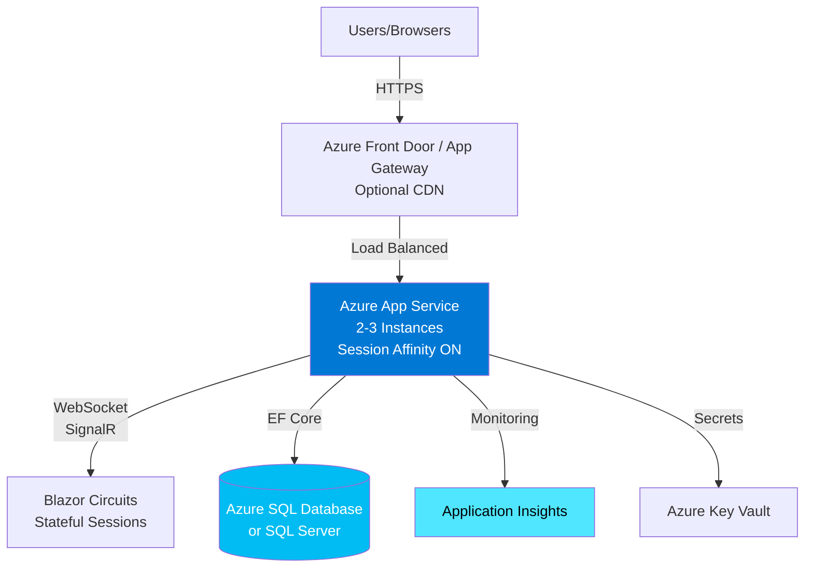

# Azure Deployment Recommendation for SSRBlazor Application

## Executive Summary

**Recommended Primary Option: Azure App Service (Linux)**

For your .NET 10 Blazor Server application, Azure App Service is the best deployment option, providing the optimal balance of simplicity, cost-effectiveness, and production-ready features. This recommendation is based on your application's architecture, Microsoft's official guidance for Blazor Server deployments, and industry best practices for 2025-2026.

---

## Application Architecture Analysis

### Current Stack
- **.NET 10** (LTS release, supported until November 2028)
- **Blazor Server** with Interactive Server Components
- **SignalR** for real-time WebSocket communication (inherent to Blazor Server)
- **SQL Server** database with Entity Framework Core
- **Cookie-based authentication** with 120-minute session timeout
- **MudBlazor** UI framework
- **Docker support** (Linux containers)
- **Repository pattern** with connection pooling

### Key Requirements
1. **Persistent WebSocket connections** for SignalR
2. **Session affinity (sticky sessions)** to maintain user state
3. **Stateful server-side rendering** with circuit management
4. **SQL Server connectivity** with connection pooling
5. **Scalability** for concurrent users
6. **Cost-effectiveness** for production workloads

---

## Azure Deployment Options Comparison

### Option 1: Azure App Service (Linux) ⭐ **RECOMMENDED**

#### Why This Is Best for Your Application

**Advantages:**
- **Zero infrastructure management** - Azure handles OS patching, runtime, scaling
- **Native Blazor Server support** - Optimized for ASP.NET Core SignalR workloads
- **Built-in session affinity (ARR Affinity)** - Essential for Blazor Server, enabled by default
- **WebSocket support** - Native support for SignalR connections
- **Deployment slots** - Zero-downtime deployments with dev → staging → production swaps
- **Auto-scaling** - Horizontal scaling based on CPU, memory, or HTTP queue depth
- **Integrated CI/CD** - Seamless GitHub Actions and Azure DevOps integration
- **Managed SSL certificates** - Free TLS certificates via Let's Encrypt
- **Cost-effective** - Starting at ~$13-15/month for Basic tier, ~$55/month for Standard tier
- **Easy database connectivity** - VNet integration for secure SQL Server access
- **Built-in monitoring** - Application Insights integration out-of-the-box

**Configuration Requirements:**
1. Enable **WebSockets**: ON (for SignalR)
2. Enable **Session Affinity (ARR Affinity)**: ON (maintains user connections to same instance)
3. Set **minimum instances**: 2+ for production (3+ for high-traffic)
4. Configure **health checks** for automatic instance recovery
5. Use **deployment slots** for staging and production

**When to Scale:**
- Start with **Standard tier (S1)**: 1 vCPU, 1.75 GB RAM (~$55/month)
- Scale out to 2-3 instances for production reliability
- Consider **Premium tier** for larger workloads (2-8 vCPU options)

**Ideal For:**
- ✅ Your current application architecture
- ✅ Teams wanting simplicity without Kubernetes complexity
- ✅ Production workloads with predictable traffic patterns
- ✅ Applications requiring 99.95% SLA

---

### Option 2: Azure Container Apps (Alternative)

**Advantages:**
- **Serverless containers** - Pay only for actual usage
- **Automatic scaling to zero** - Cost savings during idle periods
- **Simplified container orchestration** - Easier than Kubernetes
- **Built-in ingress and SSL**
- **Good for microservices** - If you plan to break app into services

**Disadvantages:**
- ⚠️ **Session affinity configuration** more complex than App Service
- ⚠️ **Cold starts** can affect user experience when scaling from zero
- ⚠️ **Less mature** for Blazor Server compared to App Service
- ⚠️ **Pricing complexity** - Consumption + resource pricing model
- ⚠️ Requires container registry management

**When to Consider:**
- You have highly variable traffic (huge spikes and valleys)
- You want to modernize toward microservices architecture
- Cost optimization during off-hours is critical

**Estimated Cost:**
- $50-150/month depending on usage patterns
- More economical for bursty workloads

---

### Option 3: Azure Kubernetes Service (AKS) (Not Recommended)

**Why Not AKS:**
- ❌ **Overkill for a monolithic application** - Significant operational overhead
- ❌ **Requires dedicated DevOps expertise** - Steep learning curve
- ❌ **Higher costs** - Starting at $100-200/month minimum
- ❌ **Complex networking** - Load balancer, ingress controllers, service mesh
- ❌ **Longer time to production** - Weeks vs. hours

**When to Use AKS:**
- You're running 10+ microservices requiring orchestration
- You need multi-region active-active deployments
- You have dedicated Kubernetes engineers
- You require advanced features like service mesh, custom operators

---

## Detailed Recommendation: Azure App Service Deployment

### Recommended Tier and Configuration

#### Production Setup
- **Tier**: Standard S1 or S2
  - S1: 1 vCPU, 1.75 GB RAM (~$55/month)
  - S2: 2 vCPU, 3.5 GB RAM (~$110/month)
- **Instance Count**: Minimum 2 instances (3 for high availability)
- **OS**: Linux (more cost-effective than Windows)
- **Runtime**: .NET 10

#### Key Settings
```
WebSockets: ON
Session Affinity (ARR Affinity): ON
Always On: ON
Health Check: /health (or appropriate endpoint)
HTTPS Only: ON
Minimum TLS: 1.2
```

### Deployment Architecture



### Cost Breakdown (Monthly Estimates)

#### Small Production (50-200 concurrent users)
- **App Service Plan (S1)**: 2 instances = ~$110/month
- **Azure SQL Database (S2 tier)**: ~$75/month
- **Application Insights**: ~$5-20/month
- **Bandwidth**: ~$10/month
- **Total**: ~$200-215/month

#### Medium Production (200-1000 concurrent users)
- **App Service Plan (S2)**: 3 instances = ~$330/month
- **Azure SQL Database (S3 tier)**: ~$150/month
- **Application Insights**: ~$20-50/month
- **Bandwidth**: ~$20-40/month
- **Total**: ~$520-570/month

#### Enterprise Production (1000+ concurrent users)
- **App Service Plan (P1v3)**: 3+ instances = ~$600-900/month
- **Azure SQL Database (Premium tier)**: ~$465+/month
- **Azure SignalR Service**: ~$150/month (optional, for massive scale)
- **Application Insights**: ~$50-100/month
- **Total**: ~$1,265-1,615/month

---

## Optional Enhancement: Azure SignalR Service

### When to Add Azure SignalR Service

**Consider When:**
- You need to scale beyond 5,000 concurrent connections
- You want to distribute SignalR connections globally
- You need stateful reconnection across server restarts

**Not Required If:**
- ✅ Your app runs on Azure App Service or Container Apps (built-in scaling)
- ✅ You have fewer than 5,000 concurrent users
- ✅ Your users are in a single geographic region

**Cost:**
- Free tier: Up to 20 concurrent connections
- Standard tier: ~$50/month (1,000 units) + $1 per additional unit

---

## Step-by-Step Deployment Plan

### Phase 1: Azure Resource Provisioning

1. **Create Resource Group**
   ```bash
   az group create --name rg-ssrblazor-prod --location eastus
   ```

2. **Create App Service Plan (Linux)**
   ```bash
   az appservice plan create \
     --name plan-ssrblazor-prod \
     --resource-group rg-ssrblazor-prod \
     --sku S1 \
     --is-linux \
     --number-of-workers 2
   ```

3. **Create App Service**
   ```bash
   az webapp create \
     --name app-ssrblazor-prod \
     --resource-group rg-ssrblazor-prod \
     --plan plan-ssrblazor-prod \
     --runtime "DOTNETCORE:10.0"
   ```

4. **Configure App Settings**
   ```bash
   # Enable WebSockets
   az webapp config set \
     --name app-ssrblazor-prod \
     --resource-group rg-ssrblazor-prod \
     --web-sockets-enabled true
   
   # Enable Session Affinity (ARR Affinity)
   az webapp update \
     --name app-ssrblazor-prod \
     --resource-group rg-ssrblazor-prod \
     --client-affinity-enabled true
   
   # Enable Always On
   az webapp config set \
     --name app-ssrblazor-prod \
     --resource-group rg-ssrblazor-prod \
     --always-on true
   ```

### Phase 2: Database Setup

1. **Create Azure SQL Database** (or use existing SQL Server)
   ```bash
   az sql server create \
     --name sql-ssrblazor-prod \
     --resource-group rg-ssrblazor-prod \
     --location eastus \
     --admin-user sqladmin
   
   az sql db create \
     --name db-ssrblazor \
     --server sql-ssrblazor-prod \
     --resource-group rg-ssrblazor-prod \
     --service-objective S2
   ```

2. **Configure Connection String** (using Key Vault)
   ```bash
   az keyvault create \
     --name kv-ssrblazor-prod \
     --resource-group rg-ssrblazor-prod \
     --location eastus
   
   az keyvault secret set \
     --vault-name kv-ssrblazor-prod \
     --name "SanSabaConnection" \
     --value "YOUR_CONNECTION_STRING"
   ```

### Phase 3: Application Configuration

1. **Update appsettings.Production.json**
   ```json
   {
     "ConnectionStrings": {
       "SanSabaConnection": "Retrieved from Azure Key Vault"
     },
     "Logging": {
       "LogLevel": {
         "Default": "Information",
         "Microsoft.AspNetCore": "Warning",
         "Microsoft.AspNetCore.SignalR": "Information"
       },
       "ApplicationInsights": {
         "LogLevel": {
           "Default": "Information"
         }
       }
     },
     "ApplicationInsights": {
       "ConnectionString": "Retrieved from Azure"
     }
   }
   ```

2. **Configure Health Check Endpoint** (add to Program.cs)
   ```csharp
   app.MapHealthChecks("/health");
   
   // Configure health check in App Service
   az webapp config set \
     --name app-ssrblazor-prod \
     --resource-group rg-ssrblazor-prod \
     --health-check-path "/health"
   ```

### Phase 4: CI/CD Pipeline Setup

#### Option A: GitHub Actions

Create `.github/workflows/azure-deploy.yml`:

```yaml
name: Deploy to Azure App Service

on:
  push:
    branches: [ main ]
  workflow_dispatch:

jobs:
  build-and-deploy:
    runs-on: ubuntu-latest
    
    steps:
    - uses: actions/checkout@v4
    
    - name: Setup .NET 10
      uses: actions/setup-dotnet@v4
      with:
        dotnet-version: '10.0.x'
    
    - name: Restore dependencies
      run: dotnet restore
    
    - name: Build
      run: dotnet build --configuration Release --no-restore
    
    - name: Test
      run: dotnet test --no-build --verbosity normal
    
    - name: Publish
      run: dotnet publish -c Release -o ${{github.workspace}}/publish
    
    - name: Deploy to Azure Web App
      uses: azure/webapps-deploy@v3
      with:
        app-name: 'app-ssrblazor-prod'
        publish-profile: ${{ secrets.AZURE_WEBAPP_PUBLISH_PROFILE }}
        package: ${{github.workspace}}/publish
```

#### Option B: Azure DevOps Pipeline

Create `azure-pipelines.yml`:

```yaml
trigger:
  branches:
    include:
    - main

pool:
  vmImage: 'ubuntu-latest'

variables:
  buildConfiguration: 'Release'
  azureSubscription: 'YOUR_SERVICE_CONNECTION'
  webAppName: 'app-ssrblazor-prod'

steps:
- task: UseDotNet@2
  inputs:
    version: '10.0.x'

- task: DotNetCoreCLI@2
  displayName: 'Restore packages'
  inputs:
    command: 'restore'

- task: DotNetCoreCLI@2
  displayName: 'Build'
  inputs:
    command: 'build'
    arguments: '--configuration $(buildConfiguration)'

- task: DotNetCoreCLI@2
  displayName: 'Publish'
  inputs:
    command: 'publish'
    publishWebProjects: true
    arguments: '--configuration $(buildConfiguration) --output $(Build.ArtifactStagingDirectory)'

- task: AzureWebApp@1
  displayName: 'Deploy to Azure App Service'
  inputs:
    azureSubscription: '$(azureSubscription)'
    appName: '$(webAppName)'
    package: '$(Build.ArtifactStagingDirectory)/**/*.zip'
```

### Phase 5: Monitoring and Observability

1. **Enable Application Insights**
   ```bash
   az monitor app-insights component create \
     --app app-ssrblazor-insights \
     --location eastus \
     --resource-group rg-ssrblazor-prod \
     --application-type web
   ```

2. **Configure Alerts**
   - Response time > 2 seconds
   - Failed requests > 5%
   - CPU usage > 80%
   - Memory usage > 85%
   - SignalR connection failures

3. **Key Metrics to Monitor**
   - Active SignalR connections
   - Circuit creation/disposal rate
   - Database connection pool utilization
   - Response times
   - Error rates

---

## Security Best Practices

### 1. Managed Identity for Azure Resources
```csharp
// Use managed identity for SQL Server access
builder.Services.AddPooledDbContextFactory<SsrDbContext>(options =>
{
    options.UseSqlServer(
        configuration.GetConnectionString("SanSabaConnection"),
        sqlOptions => {
            sqlOptions.EnableRetryOnFailure();
            // Enable Azure AD authentication
            sqlOptions.UseAzureSqlDefaults();
        }));
});
```

### 2. Azure Key Vault Integration
- Store connection strings in Key Vault
- Store authentication secrets
- Rotate keys automatically

### 3. Network Security
- Enable VNet integration for App Service
- Configure private endpoints for SQL Database
- Use Azure Front Door for DDoS protection

### 4. Application Security
- Enforce HTTPS only
- Set minimum TLS 1.2
- Enable HSTS headers
- Configure Content Security Policy
- Use Anti-forgery tokens (already configured)

---

## Scaling Strategy

### Horizontal Scaling (Scale Out)
- Start with 2 instances minimum
- Auto-scale rule: Add instance when CPU > 70% for 5 minutes
- Auto-scale rule: Remove instance when CPU < 30% for 10 minutes
- Maximum: 5-10 instances depending on tier

### Vertical Scaling (Scale Up)
- Monitor application performance metrics
- Upgrade to S2 when consistently using > 80% CPU
- Upgrade to P1v3 for premium features and performance

### SignalR Connection Management
- Configure circuit timeout: 30-120 seconds
- Implement graceful reconnection logic
- Consider Azure SignalR Service when exceeding 5,000 connections

---

## Migration Checklist

### Pre-Deployment
- [ ] Update appsettings.json with production configuration
- [ ] Test application locally with production-like settings
- [ ] Set up Azure resources (App Service, SQL Database, Key Vault)
- [ ] Configure connection strings in Key Vault
- [ ] Set up Application Insights
- [ ] Configure CI/CD pipeline

### Deployment
- [ ] Deploy application to staging slot
- [ ] Run smoke tests in staging
- [ ] Verify WebSockets and SignalR functionality
- [ ] Test authentication flows
- [ ] Verify database connectivity
- [ ] Check application logs and metrics

### Post-Deployment
- [ ] Swap staging to production
- [ ] Monitor application for 24 hours
- [ ] Set up alerts and notifications
- [ ] Document rollback procedure
- [ ] Train team on Azure portal operations
- [ ] Schedule regular backups

---

## Alternative Deployment: Docker Container to App Service

If you prefer using your existing Dockerfile:

```bash
# Build and push to Azure Container Registry
az acr create \
  --name acressrblazor \
  --resource-group rg-ssrblazor-prod \
  --sku Basic

az acr build \
  --registry acressrblazor \
  --image ssrblazor:latest \
  .

# Deploy container to App Service
az webapp create \
  --name app-ssrblazor-prod \
  --resource-group rg-ssrblazor-prod \
  --plan plan-ssrblazor-prod \
  --deployment-container-image-name acressrblazor.azurecr.io/ssrblazor:latest
```

**Note:** Container deployment adds complexity. Use native .NET deployment unless you have specific container requirements.

---

## Comparison Summary

| Feature | App Service | Container Apps | AKS |
|---------|-------------|----------------|-----|
| **Complexity** | ⭐ Low | ⭐⭐ Medium | ⭐⭐⭐⭐⭐ High |
| **Setup Time** | Hours | Days | Weeks |
| **Blazor Server Support** | ⭐⭐⭐⭐⭐ Native | ⭐⭐⭐ Good | ⭐⭐⭐ Good |
| **Session Affinity** | ✅ Built-in | ⚠️ Configure | ⚠️ Configure |
| **Cost (Small)** | $110-200/mo | $50-150/mo | $200-400/mo |
| **Cost (Medium)** | $330-570/mo | $150-300/mo | $400-800/mo |
| **Auto-scaling** | ✅ Simple | ✅ Advanced | ✅ Complex |
| **Zero-downtime Deploy** | ✅ Deployment Slots | ✅ Revision Management | ✅ Rolling Updates |
| **Maintenance** | ⭐ Minimal | ⭐⭐ Low | ⭐⭐⭐⭐ High |
| **Best For** | **Blazor Server Apps** | Microservices | Large-scale orchestration |

---

## Conclusion

**Recommendation: Deploy to Azure App Service (Linux) with Standard S1 tier**

This provides:
- ✅ **Simplest deployment path** with fastest time to production
- ✅ **Native Blazor Server support** with proper WebSocket and session handling
- ✅ **Cost-effective** starting at ~$200/month for production setup
- ✅ **Enterprise-ready** with 99.95% SLA, auto-scaling, and monitoring
- ✅ **Low operational overhead** - no container orchestration or Kubernetes expertise required
- ✅ **Proven architecture** - Microsoft's recommended approach for Blazor Server

Start with App Service, monitor performance, and scale as needed. You can always migrate to Container Apps or AKS later if requirements change, but for most Blazor Server applications, App Service provides the best balance of simplicity, performance, and cost.

---

## Next Steps

1. Review this recommendation with your team
2. Provision Azure resources in a development subscription first
3. Set up CI/CD pipeline for automated deployments
4. Conduct load testing to determine optimal instance count
5. Document runbooks for common operational tasks
6. Plan production cutover with rollback strategy

## References

- [Microsoft: Host and deploy ASP.NET Core Blazor Server](https://learn.microsoft.com/en-us/aspnet/core/blazor/host-and-deploy/server)
- [Microsoft: Deploy ASP.NET web app to Azure](https://learn.microsoft.com/en-us/azure/app-service/quickstart-dotnetcore)
- [Azure App Service pricing](https://azure.microsoft.com/en-us/pricing/details/app-service/linux/)
- [Blazor Server scalability best practices](https://learn.microsoft.com/en-us/aspnet/core/blazor/fundamentals/signalr)
