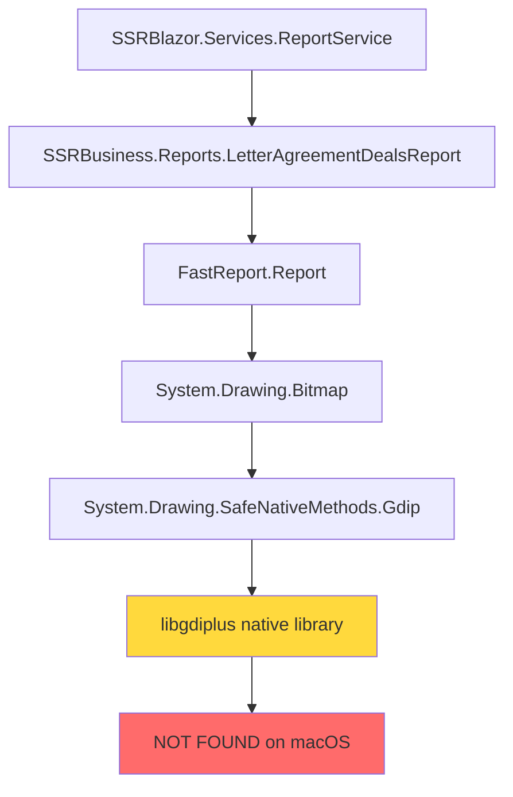

# Fix libgdiplus Dependency Error on macOS

## Problem Summary

FastReport is failing to initialize on macOS with a `System.DllNotFoundException` for `libgdiplus`. This occurs because:

1. FastReport uses **System.Drawing** for graphics operations
2. System.Drawing requires **GDI+** (Graphics Device Interface Plus)
3. On Windows, GDI+ is built-in
4. On macOS/Linux, it requires **libgdiplus** - an open-source implementation

## Error Analysis

The error shows .NET runtime searching multiple locations for libgdiplus:
- `/Users/gqadonis/.wasmedge/lib/`
- `/Users/gqadonis/.local/lib/`
- `/usr/local/share/dotnet/shared/Microsoft.NETCore.App/10.0.1/`
- `/Users/gqadonis/RiderProjects/SSRBlazor/bin/Debug/net10.0/runtimes/unix/lib/netcoreapp3.0/`
- `/usr/lib/` (not in dyld cache)

None of these locations contain the required library.

## Dependency Chain



## Solution Steps

### Step 1: Install libgdiplus via Homebrew

```bash
brew install mono-libgdiplus
```

This installs the library to one of these locations depending on Mac architecture:
- **Intel Macs**: `/usr/local/lib/libgdiplus.dylib`
- **Apple Silicon (M1/M2/M3)**: `/opt/homebrew/lib/libgdiplus.dylib`

### Step 2: Verify Installation

Check if the library was installed:

```bash
# For Intel Macs
ls -la /usr/local/lib/libgdiplus.*

# For Apple Silicon
ls -la /opt/homebrew/lib/libgdiplus.*

# Check Homebrew installation info
brew info mono-libgdiplus
```

### Step 3: Test the Application

Run your SSRBlazor application and try generating a report:

```bash
cd /Users/gqadonis/RiderProjects/SSRBlazor
dotnet run
```

Navigate to the report generation feature and verify it works.

### Step 4: Create Symlink (If Needed)

If .NET still can't find the library, create a symlink:

**For Apple Silicon (most likely your case):**
```bash
sudo mkdir -p /usr/local/lib
sudo ln -s /opt/homebrew/lib/libgdiplus.dylib /usr/local/lib/libgdiplus.dylib
```

**For Intel Macs:**
```bash
sudo ln -s /usr/local/lib/libgdiplus.dylib /usr/lib/libgdiplus.dylib
```

Note: The `/usr/lib` symlink may fail on newer macOS versions due to System Integrity Protection (SIP). The `/usr/local/lib` location should work.

### Step 5: Alternative - Environment Variable

If symlinks don't work, set the library path environment variable:

```bash
# For Apple Silicon
export DYLD_LIBRARY_PATH=/opt/homebrew/lib:$DYLD_LIBRARY_PATH

# For Intel
export DYLD_LIBRARY_PATH=/usr/local/lib:$DYLD_LIBRARY_PATH
```

Add this to your shell profile (`~/.zshrc` or `~/.bash_profile`) for persistence.

### Step 6: Rider/IDE Configuration

If running from Rider IDE, you may need to configure the environment variable:

1. Go to **Run** → **Edit Configurations**
2. Select your SSRBlazor run configuration
3. Add Environment Variable: `DYLD_LIBRARY_PATH=/opt/homebrew/lib`
4. Apply and restart

## Production Deployment Considerations

### For Linux Servers

Install libgdiplus on Ubuntu/Debian:
```bash
sudo apt-get update
sudo apt-get install -y libgdiplus
```

Install on CentOS/RHEL:
```bash
sudo yum install -y libgdiplus
```

### For Docker Containers

Add to your Dockerfile:

```dockerfile
# For Debian-based images
RUN apt-get update && \
    apt-get install -y libgdiplus && \
    rm -rf /var/lib/apt/lists/*

# For Alpine-based images
RUN apk add --no-cache libgdiplus
```

### For Windows Servers

No action needed - GDI+ is built into Windows.

## Alternative Solutions (Future Consideration)

If libgdiplus continues to cause issues across environments, consider:

1. **SkiaSharp** - Cross-platform 2D graphics library by Microsoft
   - More reliable on non-Windows platforms
   - Better performance
   - Requires code changes to FastReport initialization

2. **QuestPDF** - Modern, open-source PDF library
   - Fluent API design
   - Better cross-platform support
   - Would require rewriting report generation code

3. **Docker Standardization** - Run all development in Docker
   - Ensures consistent environment
   - Pre-configured with all dependencies
   - Slight overhead in development workflow

## Documentation for Team

Create a **DEVELOPMENT_SETUP.md** file with:

```markdown
# Development Setup - macOS

## Prerequisites

### Install libgdiplus

FastReport requires libgdiplus for graphics operations:

\`\`\`bash
brew install mono-libgdiplus
\`\`\`

If reports still fail, create a symlink:

\`\`\`bash
sudo ln -s /opt/homebrew/lib/libgdiplus.dylib /usr/local/lib/libgdiplus.dylib
\`\`\`

## Troubleshooting

If you see "Unable to load shared library 'libgdiplus'":
1. Verify installation: `brew list mono-libgdiplus`
2. Check library location: `ls -la /opt/homebrew/lib/libgdiplus.*`
3. Set environment variable: `export DYLD_LIBRARY_PATH=/opt/homebrew/lib`
```

## Troubleshooting Guide

### Issue: brew command not found
**Solution**: Install Homebrew first: `/bin/bash -c "$(curl -fsSL https://raw.githubusercontent.com/Homebrew/install/HEAD/install.sh)"`

### Issue: Library installed but still not found
**Solution**: Check your Mac architecture and ensure you're looking in the right location:
```bash
uname -m  # arm64 = Apple Silicon, x86_64 = Intel
```

### Issue: Permission denied when creating symlink
**Solution**: Use `sudo` for the symlink command or adjust your security settings

### Issue: Works in terminal but not in Rider
**Solution**: Configure environment variables in Rider's run configuration

### Issue: Production deployment on Linux fails
**Solution**: Ensure libgdiplus is installed in your Docker image or deployment scripts

## Success Criteria

✅ FastReport initializes without errors  
✅ Reports generate successfully  
✅ No `DllNotFoundException` in logs  
✅ Works in both terminal and IDE  
✅ Solution documented for team members

## Next Steps

After fixing the local development issue:
1. Document the solution in team wiki/README
2. Add libgdiplus installation to deployment scripts
3. Consider creating a development Docker setup for consistency
4. Evaluate long-term alternatives to FastReport if cross-platform issues persist
